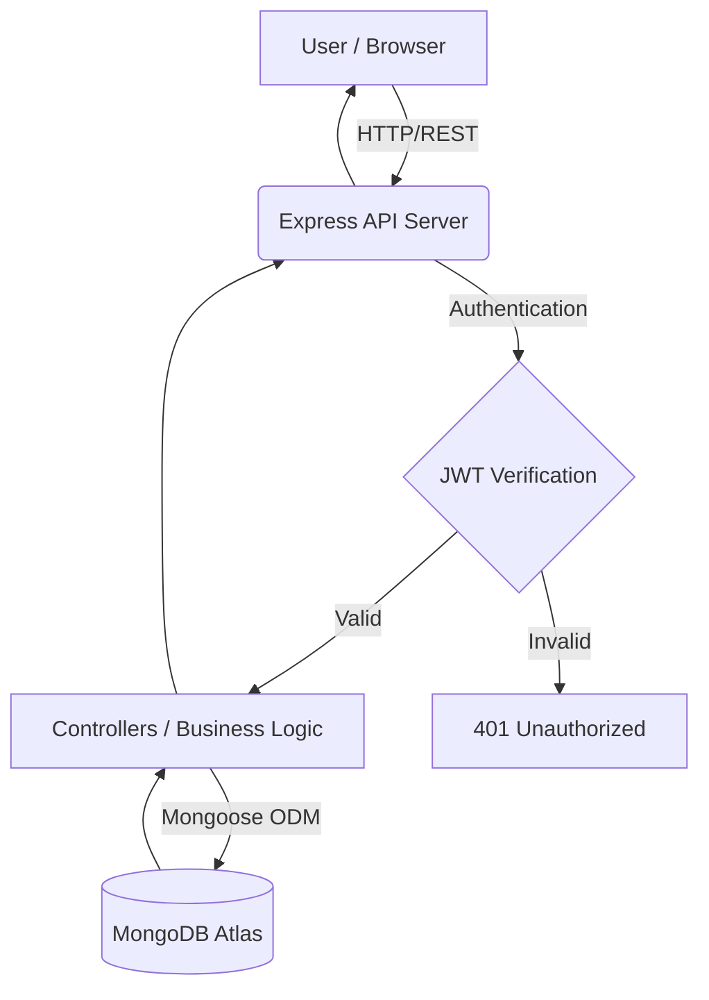

# 🚀 Startup CRM Lite

<div align="center">
  
</div>

<div align="center">
  
  
  
  
  
</div>

<br />

## 📑 Table of Contents
1. [Project Overview](#-project-overview)
2. [Problem Statement](#-problem-statement)
3. [Vision & Objectives](#-vision--objectives)
4. [Key Features](#-key-features)
5. [Target Users & Use Cases](#-target-users--use-cases)
6. [Business Value](#-business-value)
7. [System Architecture](#-system-architecture)
8. [Technology Stack](#-technology-stack)
9. [Project Structure & Modules](#-project-structure--modules)
10. [Database Architecture](#-database-architecture)
11. [API Overview](#-api-overview)
12. [Authentication & Authorization](#-authentication--authorization)
13. [Security & Performance](#-security--performance)
14. [Getting Started (Installation & Setup)](#-getting-started)
15. [Deployment Guide](#-deployment-guide)
16. [Project Conventions & Guidelines](#-project-conventions--guidelines)
17. [Roadmap & Future Enhancements](#-roadmap--future-enhancements)
18. [FAQ & Troubleshooting](#-faq--troubleshooting)

---

## 🌟 Project Overview
**Startup CRM Lite** is a lightweight, modern Full-Stack Customer Relationship Management (CRM) application designed specifically for early-stage startups and small sales teams. It offers a streamlined, distraction-free environment to track, qualify, and convert sales leads without the bloat and complexity of enterprise tools like Salesforce or HubSpot. 

## 🚨 Problem Statement
Early-stage startups often rely on scattered spreadsheets or overly complex enterprise CRMs to manage their sales pipeline. Spreadsheets lack validation, collaboration, and analytics, while enterprise CRMs are expensive, hard to configure, and require significant onboarding time. This creates a gap for a simple, fast, and secure lead management tool tailored to small teams.

## 🎯 Vision & Objectives
To provide a fast, secure, and visually appealing open-source CRM that allows founders and sales representatives to get started in minutes. The objective is to maximize user productivity with an intuitive UI, fast API responses, and actionable analytics.

## ✨ Key Features
- **Dashboard & Analytics**: At-a-glance KPI metrics, pipeline value overview, recent prospects table, revenue pipeline trend charts, and sales conversion funnels.
- **Lead Management**: Full CRUD operations with table and card views, status-based filtering, and debounced search.
- **Secure Authentication**: JWT-based authentication with bcrypt password hashing and role-based access control (Admin/User).
- **Dark / Light Mode**: System preference-aware theme with persistent storage.
- **Responsive Design**: Mobile-first layout with an adaptive sidebar and stacked card views on smaller screens.
- **Data Protection**: Advanced backend security including Helmet (HTTP Headers), Express Rate Limiting, and robust input validation.

---

## 👥 Target Users & Use Cases

### Target Users
- **Startup Founders**: Managing early sales outreach and investor networking.
- **Sales Representatives**: Tracking their individual pipeline and closing deals.
- **Growth Marketers**: Monitoring lead acquisition channels (Website, LinkedIn, Cold Call).

### Use Cases
1. **Inbound Lead Qualification**: Automatically capture or manually log inbound inquiries from a startup's website.
2. **Outbound Tracking**: Log cold calls, emails, and LinkedIn outreach, tracking the transition from "Contacted" to "Meeting Scheduled".
3. **Revenue Forecasting**: Utilize the analytics dashboard to estimate potential deal closures and pipeline value.

## 💼 Business Value
- **Accelerated Sales Cycle**: Centralized tracking ensures no lead falls through the cracks.
- **Zero Onboarding Cost**: Simple UI means new team members can use it immediately without training.
- **Data Ownership**: Self-hosted architecture guarantees complete ownership of customer data.

---

## 🏗️ System Architecture

### High-Level Architecture Overview
Startup CRM Lite utilizes a decoupled **Client-Server Architecture**. 
- **Tier 1 (Presentation Layer)**: A Single Page Application (SPA) built with React and Vite.
- **Tier 2 (Application Layer)**: A RESTful API built on Node.js and Express.
- **Tier 3 (Data Layer)**: A MongoDB database managed via Mongoose ODM.

### Application Workflow


### End-to-End User Flow
1. **Onboarding**: User creates an account or logs in securely.
2. **Dashboard Overview**: User lands on the Dashboard to see pending tasks, pipeline value, and recent leads.
3. **Pipeline Management**: User navigates to the Leads section to add a new prospect or move an existing prospect to a new pipeline stage (e.g., "Proposal Sent" -> "Won").
4. **Insights Generation**: User views the Analytics page to analyze which lead sources yield the highest conversion rate.

---

## 🛠️ Technology Stack

| Domain | Technology | Purpose |
|--------|------------|---------|
| **Frontend** | React 19, Vite | Fast, component-based UI rendering. |
| **Styling** | Tailwind CSS v4 | Utility-first CSS for rapid, responsive design. |
| **Routing** | React Router v7 | Client-side routing and navigation. |
| **Charts/Icons** | Recharts, Lucide | Data visualization and clean SVG iconography. |
| **Backend** | Node.js, Express 5 | Asynchronous, event-driven API server. |
| **Database** | MongoDB, Mongoose 9 | NoSQL database and Object Data Modeling. |
| **Security** | JWT, bcryptjs, Helmet | Authentication, password hashing, and HTTP security. |

---

## 📁 Project Structure & Modules

The repository follows a monorepo-style structure containing both the React frontend and Node backend.

```
startup-crm-lite/
├── backend/                  # Application Layer (Node.js/Express API)
│   ├── config/               # Database and environmental configuration
│   ├── controllers/          # Business logic (authController, leadController)
│   ├── middleware/           # Express middleware (errorHandler, auth)
│   ├── models/               # Mongoose schemas (User, Lead)
│   ├── routes/               # API endpoint definitions
│   ├── utils/                # Helper functions
│   └── server.js             # API entry point & Express instantiation
├── src/                      # Presentation Layer (React Frontend)
│   ├── assets/               # Static assets (images, global CSS)
│   ├── components/           # Reusable UI components
│   │   ├── analytics/        # Charts and KPI widgets
│   │   ├── common/           # Layouts, Sidebar, SearchBar
│   │   ├── dashboard/        # Dashboard specific views
│   │   └── leads/            # Lead forms, tables, and cards
│   ├── context/              # React Context (State Management)
│   ├── hooks/                # Custom React hooks (e.g., useLocalStorage)
│   ├── pages/                # Top-level route components
│   ├── routes/               # Client routing configuration
│   └── services/             # API client services (Axios interceptors)
├── .env                      # Global environment variables
├── package.json              # Root dependencies and NPM scripts
└── vite.config.js            # Vite build configuration
```

### Important Files Explained
- **`backend/server.js`**: Bootstraps the Express application, configures security headers (Helmet), logging (Morgan), rate limiting, and mounts API routes.
- **`backend/models/Lead.js`**: Defines the data schema for a Lead, including strict validations, compound indexes for performance, and computed virtual fields (like `age`).
- **`backend/models/User.js`**: Manages user accounts, handles bcrypt password hashing via Mongoose `pre-save` hooks, and manages roles.
- **`package.json` (Root)**: Contains `concurrently` scripts to run both the frontend and backend simultaneously for seamless development.

---

## 🗄️ Database Architecture

The application uses MongoDB as its primary data store, leveraging its flexible document structure.

### Collections
1. **Users**: Stores authentication credentials, profiles, and roles.
2. **Leads**: Stores pipeline prospects, assigned to specific Users.

### Indexing Strategy
To ensure optimal performance even with millions of records, the database implements strategic indexing:
- `Compound Index (owner, status)`: Optimizes dashboard queries filtering leads by pipeline stage.
- `Compound Index (owner, createdAt)`: Supports fast date-range aggregations for charts.
- `Compound Index (owner, name)`: Enables rapid text-search and auto-completion scoped to the logged-in user.

---

## 🔌 API Overview

The backend exposes a RESTful JSON API. All endpoints under `/api/leads` require a valid JWT Bearer token.

| Endpoint | Method | Description | Access |
|----------|--------|-------------|--------|
| `/api/auth/register` | POST | Register a new user | Public |
| `/api/auth/login` | POST | Authenticate and retrieve JWT | Public |
| `/api/leads` | GET | Retrieve paginated leads for the current user | Private |
| `/api/leads` | POST | Create a new lead | Private |
| `/api/leads/:id` | PUT | Update an existing lead | Private |
| `/api/leads/:id` | DELETE | Delete a lead | Private |
| `/api/leads/stats` | GET | Retrieve analytical data for charts | Private |

---

## 🔐 Authentication & Authorization
- **Authentication**: Driven by JSON Web Tokens (JWT). Upon successful login, the server issues a signed token valid for a specified duration. The client includes this token in the `Authorization: Bearer <token>` header of subsequent requests.
- **Authorization**: The backend `auth` middleware verifies the token signature and injects the `req.user` object. Users are strictly isolated—they can only perform CRUD operations on Leads where `owner === req.user.id`.

---

## 🛡️ Security & Performance

### Security Considerations
- **Password Security**: Plain-text passwords are never stored. `bcryptjs` applies a work factor (salt rounds) to mitigate brute-force and rainbow table attacks.
- **HTTP Headers**: `helmet` dynamically sets Content-Security-Policy, X-Frame-Options, and HSTS headers.
- **Rate Limiting**: `express-rate-limit` prevents DoS attacks and brute-force credential stuffing by limiting requests per IP.
- **Input Validation**: Mongoose schemas provide rigorous validation, supplemented by `express-validator` to sanitize incoming payloads before they hit the database.

### Performance Optimizations
- **Database**: Highly optimized compound indexes prevent collection scans.
- **Frontend**: Debounced search inputs minimize API thrashing during rapid typing. React Router lazy loading splits JavaScript bundles to decrease Initial Load Time.

---

## 🚀 Getting Started

### Development Prerequisites
- Node.js (v18 or higher recommended)
- NPM or Yarn
- MongoDB Server (Local instance or MongoDB Atlas cluster)

### Installation Guide

1. **Clone the repository:**
   ```bash
   git clone https://github.com/your-username/startup-crm-lite.git
   cd startup-crm-lite
   ```

2. **Install dependencies:**
   This command installs frontend dependencies and automatically runs a `postinstall` script to install backend dependencies.
   ```bash
   npm install
   ```

3. **Environment Variables Configuration:**
   Create a `.env` file in the root directory. Use `.env.example` as a reference if available.
   ```env
   # .env
   PORT=5000
   NODE_ENV=development
   MONGODB_URI=mongodb://127.0.0.1:27017/startup_crm
   JWT_SECRET=your_super_secret_jwt_key_change_in_production
   ```
   *(Note: The backend fails fast and terminates if `MONGODB_URI`, `JWT_SECRET`, or `PORT` are missing.)*

4. **Run the Project:**
   Start both the Vite frontend server and the Express backend server concurrently:
   ```bash
   npm run dev
   ```
   - Frontend available at: `http://localhost:5173`
   - Backend API available at: `http://localhost:5000`

---

## 🚢 Deployment Guide

The project is structured to be easily deployed to modern PaaS providers. It includes configuration files like `vercel.json`, `Procfile`, and `nixpacks.toml`.

### Production Build
To create an optimized production build of the frontend:
```bash
npm run build
```

### Hosting Strategy
- **Frontend**: Deploy the `dist/` folder to Vercel, Netlify, or Cloudflare Pages.
- **Backend**: Deploy the Node server to Render, Heroku, or DigitalOcean App Platform. Ensure you set the environment variables (`NODE_ENV=production`, `MONGODB_URI`, `JWT_SECRET`) in the hosting provider's dashboard.

---

## 📝 Project Conventions & Guidelines

### Coding Standards
- **JavaScript Standard**: ES Modules (`"type": "module"`) used throughout both frontend and backend.
- **Formatting & Linting**: Enforced via ESLint. Use `npm run lint` to check for code issues.
- **Component Architecture**: React components should remain modular, relying on hooks for business logic and Tailwind for isolated styling.

### Branching Strategy
We follow **GitHub Flow**:
1. `main` is the stable, production-ready branch.
2. Create feature branches (e.g., `feature/add-email-integration`) from `main`.
3. Submit a Pull Request (PR) for code review before merging.

### Contribution Guidelines
1. Fork the repository.
2. Create a new branch for your feature or bugfix.
3. Commit your changes with clear, descriptive commit messages.
4. Push to your fork and submit a Pull Request.

---

## 🔮 Roadmap & Future Enhancements
- [ ] **Email Integration**: Two-way email syncing via IMAP/SMTP to track client communication directly within the CRM.
- [ ] **Calendar Sync**: Google Calendar / Outlook integration for scheduling meetings directly from a Lead Card.
- [ ] **OAuth 2.0 Login**: Support for "Sign in with Google" and GitHub.
- [ ] **Kanban Board**: Drag-and-drop pipeline management for a more visual experience.
- [ ] **Team Collaboration**: Ability to tag colleagues in Lead notes and share specific pipelines.

---

## ❓ FAQ & Troubleshooting

**Q: I get a `querySrv ECONNREFUSED` error when starting the backend.**  
**A:** This is often related to ISP DNS issues resolving MongoDB Atlas SRV records. The `server.js` file attempts to force Google DNS (`8.8.8.8`) to bypass this, but you may need to ensure your IP is whitelisted in your MongoDB Atlas Network Access settings.

**Q: Port 5000 is already in use.**  
**A:** macOS AirPlay Receiver sometimes occupies port 5000. Change the `PORT` variable in your `.env` file to `5001` or another open port.

**Q: The frontend cannot communicate with the backend.**  
**A:** Ensure your backend server is running and check the Vite proxy settings in `vite.config.js` to verify API calls are correctly forwarded.

---

## 📄 License
This project is licensed under the **ISC License**. See the package.json for more details.

## 🤝 Credits & Contact
- **Architecture & Design**: Principal Open Source Contributors
- **Contact**: For enterprise support or inquiries, please open an issue in the GitHub repository.

---
*Generated by AI Documentation Architect. Designed for production readiness and developer success.*
